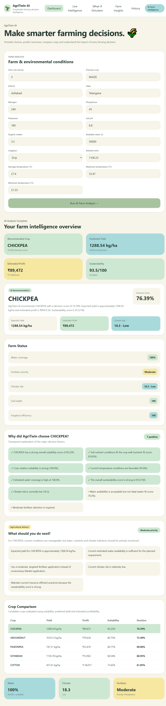
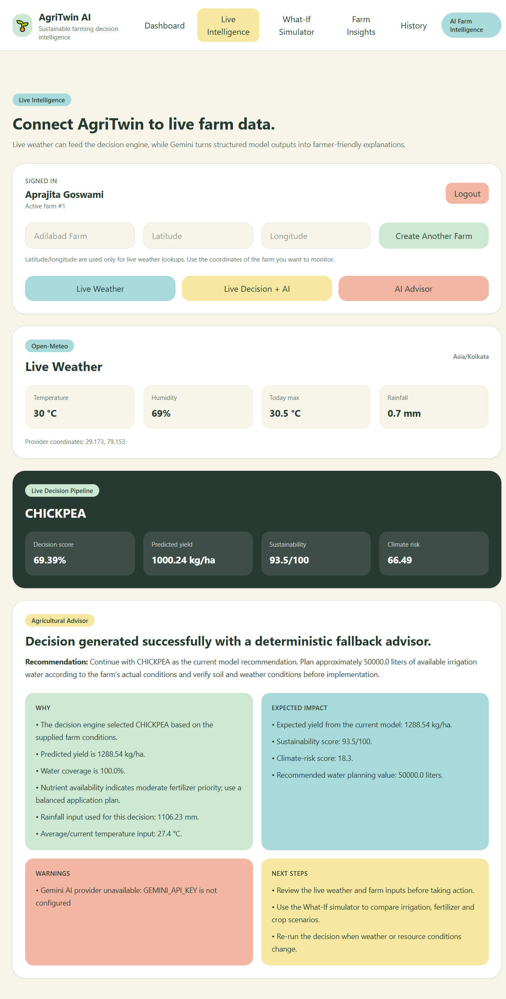
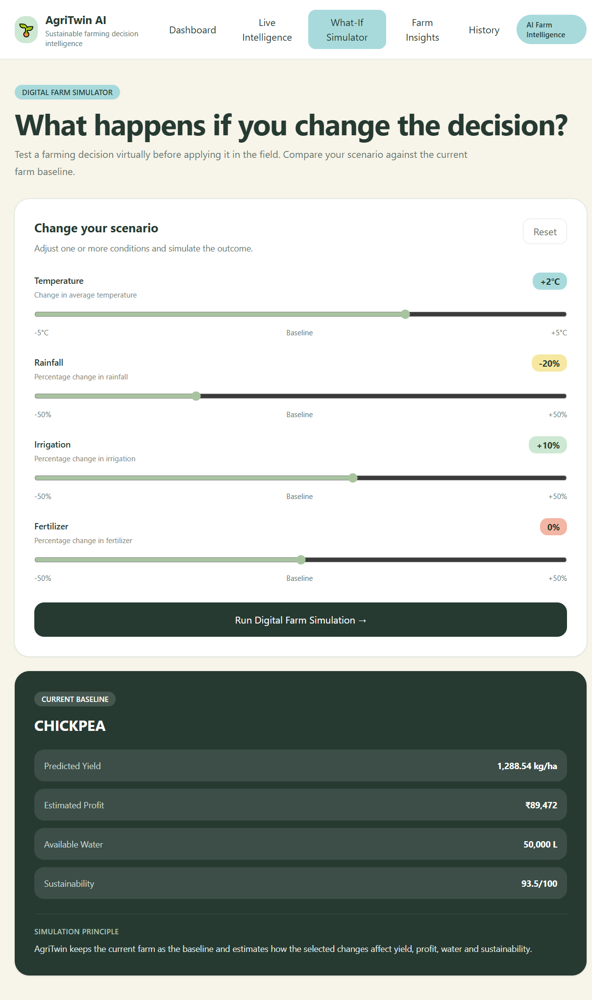
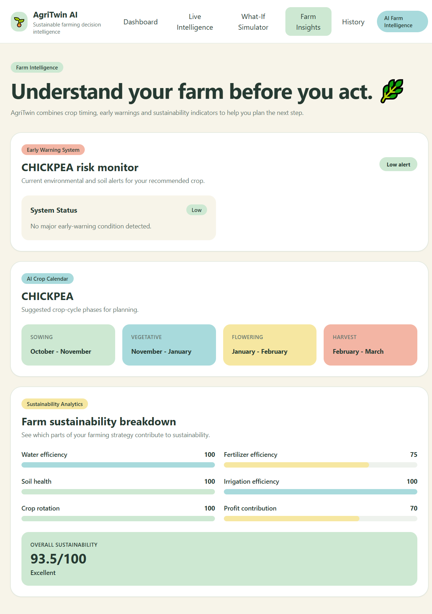
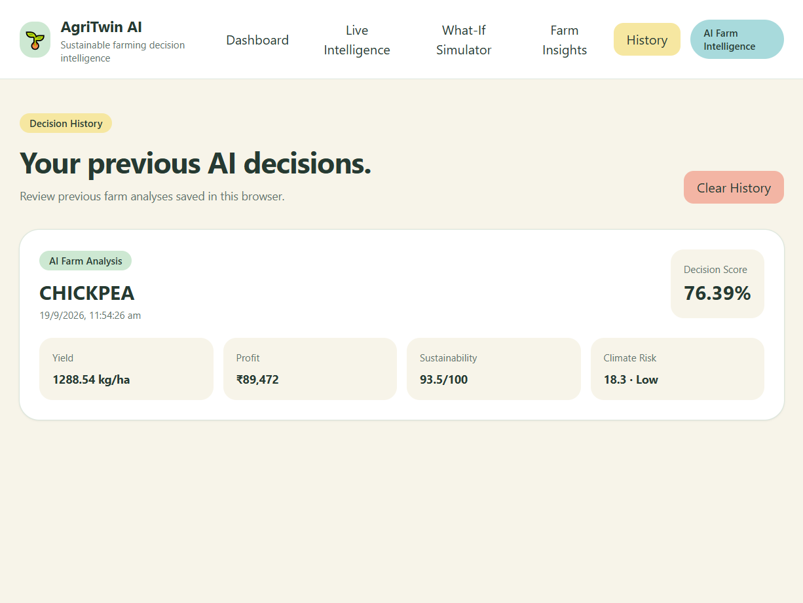

# 🌱 AgriTwin AI

> **AI-Powered Sustainable Farming Decision & Simulation Platform**

AgriTwin AI is a software-based agricultural decision-support platform that combines **Machine Learning, real-time weather intelligence, resource analysis, sustainability scoring, What-If simulation, and GenAI** to support data-driven farming decisions.

It focuses on two questions:

> 🌾 **What should I do?**
> 🔄 **What will happen if I do it?**

## 🚀 Live Demo

**Live Application:** https://agritwin-ai-sigma.vercel.app/
**API Documentation:** https://agritwin-ai-1d4j.onrender.com/docs
**GitHub:** https://github.com/Aprajita348/AgriTwin-AI

---

## ✨ Features

* 🌾 **Farm Intelligence** — analyzes crop, soil, weather, irrigation, and farm inputs.
* 🤖 **Yield Prediction** — XGBoost-based crop yield estimation.
* 🌱 **Crop Recommendation** — compares 5 crop alternatives using yield, profit, water, fertilizer, climate risk, and sustainability.
* 💧 **Resource Analysis** — evaluates water, irrigation, fertilizer, and resource efficiency.
* 🌦️ **Live Weather Intelligence** — integrates Open-Meteo weather data.
* ⚠️ **Climate Risk Analysis** — considers temperature and rainfall conditions.
* 🔄 **What-If Simulator** — simulates changes in temperature, rainfall, irrigation, and fertilizer usage.
* 🤖 **AI Agricultural Advisor** — provides explanations and recommendations using Gemini with a rule-based fallback.
* 📚 **Decision History** — allows users to review previous decisions and simulations.
* 🔐 **Authentication** — JWT-based authentication with password hashing and protected farm operations.

---

## 🧠 Machine Learning

AgriTwin AI uses an **XGBoost Regression model** for crop yield estimation.

| Metric             |                  Value |
| ------------------ | ---------------------: |
| Historical Records |              **123K+** |
| Crops              |                 **23** |
| Years of Data      |                 **18** |
| R² Score           |      **0.8066 (~81%)** |
| MAE                |       **288.05 kg/ha** |
| RMSE               |       **700.30 kg/ha** |
| Crop Alternatives  |                  **5** |
| Model              | **XGBoost Regression** |

The ML model provides yield estimates and works alongside rule-based agricultural decision logic.

---

## 🔄 Decision Pipeline

```text
Farm Inputs
    ↓
XGBoost Yield Prediction
    ↓
Resource Analysis
    ↓
Climate Risk Analysis
    ↓
Sustainability Analysis
    ↓
Decision Engine
    ↓
What-If Simulation
    ↓
AI Explanation
```

---

## 🛠️ Tech Stack

**Frontend:** React.js, Vite, JavaScript, Tailwind CSS

**Backend:** Python, FastAPI, Uvicorn, SQLAlchemy, Pydantic

**Database:** PostgreSQL

**Machine Learning:** XGBoost, Scikit-learn, Pandas, NumPy, Joblib

**Authentication:** JWT, bcrypt, Passlib

**APIs & AI:** REST APIs, Open-Meteo, Google Gemini

**Testing & DevOps:** Pytest, Git, GitHub Actions, Docker

**Deployment:** Vercel, Render

---

## 📂 Project Structure

```text
AgriTwin-AI/
├── backend/
│   ├── app/
│   ├── tests/
│   └── requirements.txt
│
├── frontend/
│   ├── src/
│   └── package.json
│
├── data/
├── screenshots/
├── .gitignore
└── README.md
```

---

## ⚙️ Setup

### 1. Clone

```bash
git clone https://github.com/Aprajita348/AgriTwin-AI.git
cd AgriTwin-AI
```

### 2. Backend

```bash
cd backend
python -m venv venv
```

**Windows:**

```bash
.\venv\Scripts\activate
```

Install dependencies:

```bash
pip install -r requirements.txt
```

Run:

```bash
uvicorn app.main:app --reload
```

Backend: `http://127.0.0.1:8000`

API Docs: `http://127.0.0.1:8000/docs`

### 3. Frontend

Open another terminal:

```bash
cd frontend
npm install
npm run dev
```

Frontend: `http://localhost:5173`

---

## 🔑 Environment Variables

Create `backend/.env`:

```env
JWT_SECRET_KEY=your_secure_secret_key
DATABASE_URL=your_database_url
GEMINI_API_KEY=your_gemini_api_key
```

Do not commit secrets or API keys to GitHub.

---

## 🧪 Testing

Run the backend test suite:

```bash
pytest
```

Tests cover authentication, farm operations, decision APIs, What-If simulation, AI fallback, input validation, and API error handling.

---

## 📸 Screenshots

### Dashboard



### Live Intelligence



### What-If Simulator



### Farm Insights



### Decision History



---

## ⚠️ Limitations

* Profit calculations use project-defined assumptions.
* Some agricultural calculations use rule-based logic.
* Live weather and Gemini features depend on external APIs.
* Yield prediction is currently a point estimate.
* Decision history currently uses browser storage.
* The platform is a software simulation and does not control physical farm equipment.
* Results should be validated with local agricultural knowledge and real-world field conditions before practical use.

---

## 👩‍💻 Developer

**Aprajita Goswami**
B.Tech CSE, Graphic Era Hill University, Bhimtal

**LinkedIn:** https://linkedin.com/in/aprajita-goswami-3258b92b8
**GitHub:** https://github.com/Aprajita348

---

## 🌱 Project Philosophy

> **Predict better. Decide smarter. Simulate before you act.**
